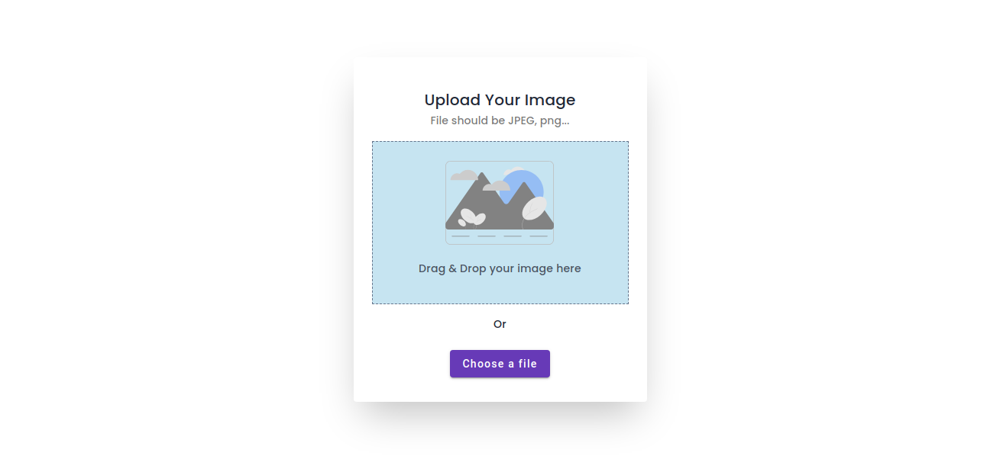

<!-- Please update value in the {}  -->

<h1 align="center" width="200" >Uploa-d</h1>
 
<div align="center">
   Solution for a challenge from  <a href="http://devchallenges.io" target="_blank">Devchallenges.io</a>.
</div>

<div align="center">
  <h3>
    <a href="https://uploa-d.vercel.app/">
      Demo
    </a>
    <span> | </span>
    <a href="https://github.com/qurriahSam/uploa-d.git">
      Solution
    </a>
  </h3>
</div>

<!-- TABLE OF CONTENTS -->

## Table of Contents

- [Overview](#overview)
  - [Built With](#built-with)
- [Features](#features)
- [How to use](#how-to-use)
- [Contact](#contact)

<!-- OVERVIEW -->

## Overview



Upload is a user-friendly Image Uploader application designed to make image sharing a breeze. With 'Upload,' you can effortlessly add images by simply dragging and dropping them or selecting one from your local folder.Once your image is uploaded, you can instantly view it and easily copy the image for sharing or other purposes."

### Built With

<!-- This section should list any major frameworks that you built your project using. Here are a few examples.-->

- [Angular](https://angular.io)
- [Angular-Material](https://material.angular.io)
- [Tailwind](https://tailwindcss.com/)
- [Material-Icons](https://fonts.google.com/)

## Features

<!-- List the features of your application or follow the template. Don't share the figma file here :) -->

This application/site was created as a submission to a [DevChallenges](https://devchallenges.io/challenges) challenge. The [challenge](https://legacy.devchallenges.io/challenges/O2iGT9yBd6xZBrOcVirx) was to build an application to complete the given user stories.

## How To Use

<!-- Example: -->

To clone and run this application, you'll need [Git](https://git-scm.com) and [Node.js](https://nodejs.org/en/download/) (which comes with [npm](http://npmjs.com)) and [angular-cli](https://angular.io/cli) installed on your computer. From your command line:

```bash
# Clone this repository
$ git clone https://github.com/qurriahSam/windbnb

# Install dependencies
$ npm install

# Run the app
$ ng serve
```

## Contact

- LinkedIn [Sam Kuria](https://www.linkedin.com/in/sam-kuria/)
